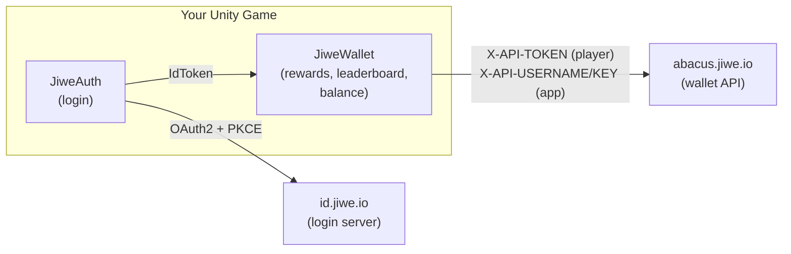
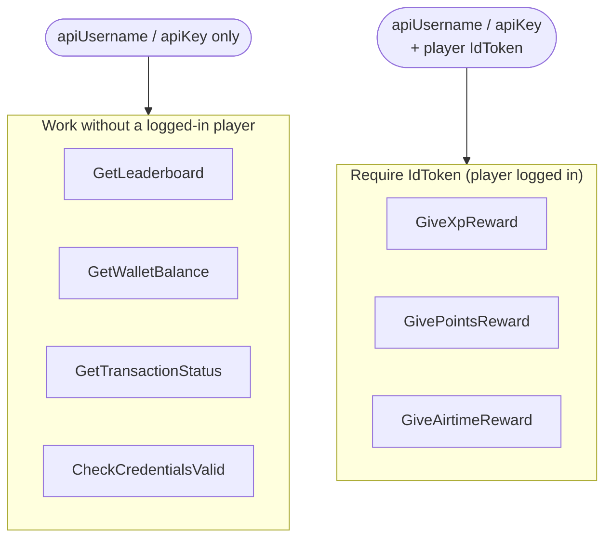
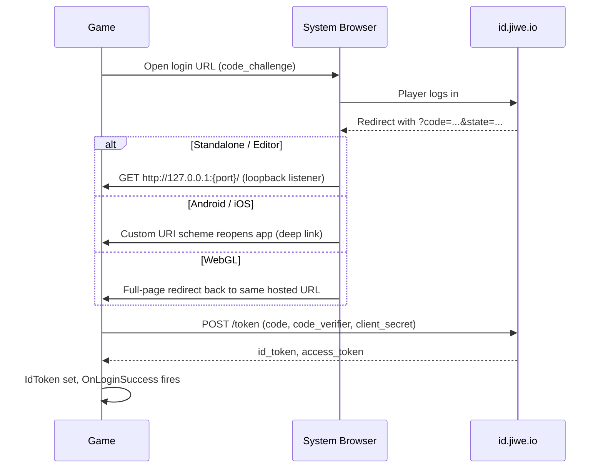

# Jiwe Wallet SDK for Unity

Log players into Jiwe with OAuth2 + PKCE, then credit them XP/points/airtime and read
leaderboard/wallet data — against Jiwe's real, live API (`id.jiwe.io` for auth,
`abacus.jiwe.io` for wallet calls).

Two scripts, no dependencies: `JiweAuth.cs` handles login, `JiweWallet.cs` handles
everything else. Copy `Jiwe/` into `Assets/` and you're done importing.

> **This doc is Unity-specific.** The concepts below — two credential pairs, the
> redirect-URI model, the reward/leaderboard API shape, the security rules — are the
> same on any engine. If you're building the Unreal or Godot SDK next, §2, §3, §5,
> §7, and §8 are the ones to port; §4 (Quickstart) and §6 (per-platform login
> mechanics) are Unity/C#-specific.

---

## 1. Architecture at a glance



`JiweAuth` logs a *player* in and produces an `IdToken`. `JiweWallet` uses that token
for player-scoped calls, plus a separate static credential pair for app-scoped calls.
They're independent components wired together by one Inspector reference
(`JiweWallet.auth`).

---

## 2. Two credential pairs — don't confuse them

This is the single most common integration mistake: there are **two unrelated
credential pairs**, not one.

| Pair | Lives on | Identifies | Required for |
|---|---|---|---|
| `clientId` + `apiSecret` | `JiweAuth` | your **app**, used to run OAuth login | Logging a player in at all |
| `apiUsername` + `apiKey` | `JiweWallet` | your **app**, sent as `X-API-USERNAME`/`X-API-KEY` | Every wallet API call, even before login |

Get all four by logging in at [www.jiwe.io](http://www.jiwe.io) → **Profile** →
**My Apps** → **Create an Application** — one application per game. **Before you
open that form, read §3** — it asks for a Redirect URI you need to have decided
already, not something to improvise mid-form.



There is **no purchase (charge-the-player) endpoint** in the current API — an older
SDK's `Purchase()` call has no live equivalent and was removed rather than left
pointing at a dead host.

---

## 3. Redirect URIs — decide these *before* you create your app

The app-creation form (§2) has a **Redirect URIs** field that's blank by default,
with no platform default shown in the UI. **Jiwe doesn't generate or infer this
value — you define it yourself, once, in the form** — and it must then match,
exactly, whatever `redirect_uri` your build actually sends on login. Decide these
per platform *before* you fill in the form, using what `JiweAuth` actually sends:

| Platform | `redirect_uri` the SDK actually sends | Register this |
|---|---|---|
| Standalone / Editor | `http://127.0.0.1:<random port>/` — a **new free port every login**, as shipped | Not registerable as-is — see fix below |
| Android / iOS | `<mobileRedirectScheme>://oauth-callback` — default scheme is `jiwewallet` unless you changed the `mobileRedirectScheme` field on `JiweAuth` | `jiwewallet://oauth-callback` (or your own scheme, kept in sync with the Inspector field) |
| WebGL | Your hosted game's own page URL, no query string (e.g. `https://yourgame.com/play`) | That exact hosted URL — one entry **per environment** (local/staging/production), see note below |

> **Standalone/Editor as shipped can't be registered, because it's not one fixed
> value** — `JiweAuth` picks a new free loopback port every login
> (`GetFreeLoopbackPort()` in `JiweAuth.cs`), and since the redirect URI you
> register is a value *you* fix once in the form, a moving port can never match it.
> **Before your first Standalone/Editor login test**, pin that method to a single
> constant port (e.g. `http://127.0.0.1:53682/`) and register that exact string.
> Skipping this means Standalone/Editor login fails on every attempt with a
> redirect_uri mismatch — it isn't optional or Editor-only-a-quirk, it's required
> for that platform to work at all.

> **WebGL doesn't have Standalone's random-port problem — your hosted URL is
> already one fixed value — but you almost certainly deploy to more than one
> URL**, and each needs its own exact entry in the same Redirect URIs field
> (it accepts a comma-separated list — see the form's own placeholder text):
> - **Local testing**: whatever serves your local WebGL build must also be a
>   **fixed, predictable URL** (e.g. always `http://localhost:8000/`), or you're
>   back to the same moving-target problem Standalone has — pick one local dev
>   server/port and stick to it rather than letting it float.
> - **Staging and production**: register both, as separate exact entries, the
>   moment you know those domains — not just production.
> - **CORS is a separate ask from redirect_uri registration.** Registering a URL
>   here does not also whitelist it for the browser-side token-exchange request —
>   ask Jiwe (§9) to CORS-whitelist every domain you just registered, at the same
>   time, so you don't rediscover this domain-by-domain as each environment goes
>   live.

The same form also has an **"My app will..."** scope checklist — check every scope
the SDK actually requests (`openid`, `profile`, `in-app-purchases`, `rewards`; see
the `Scope` constant in `JiweAuth.cs`). Leaving one unchecked produces the same
undiagnosable `access_denied` redirect as a missing `scope` param — decide this
alongside your redirect URIs, not after a failed login.

---

## 4. Quickstart

1. **Decide your redirect URIs and scopes** — see §3. Do this first; you need the
   values in hand for step 2.
2. **Get credentials.** Log in at [www.jiwe.io](http://www.jiwe.io) → **Profile** →
   **My Apps** → **Create an Application**, entering the redirect URIs/scopes from
   step 1, to generate `clientId` / `apiSecret` / `apiUsername` / `apiKey` for this
   game.
3. **Import.** Copy `Jiwe/` (`JiweAuth.cs` + `JiweWallet.cs`) into `Assets/`. No
   Newtonsoft dependency — it uses Unity's built-in `JsonUtility`.
4. **Wire it up.** Create an empty GameObject ("JiweSDK"), add both `JiweAuth` and
   `JiweWallet` to it, and drag the `JiweAuth` component into `JiweWallet.auth`.
5. **Fill in credentials** on the two components (see the table in §2). Do this via a
   gitignored config asset, not hardcoded — see §7.
6. **Run.** With `loginOnStart` checked (default), the login page opens automatically;
   `JiweAuth.OnLoginSuccess` fires once `IdToken` is populated.

```csharp
jiweAuth.OnLoginSuccess += () => {
    jiweWallet.GiveXpReward(20, "Reward for passing boss#1", result => {
        if (result.Success) Debug.Log("XP awarded!");
        else Debug.LogWarning($"XP reward failed: {result.Error}");
    });
};
```

---

## 5. API reference

All calls are async/callback-based; every result carries `Success` + `Error` (+
call-specific fields).

| Method | Needs login? | Notes |
|---|---|---|
| `GiveXpReward(xp, description, onComplete, transactionId?)` | Yes | XP has no monetary value |
| `GivePointsReward(points, description, onComplete, transactionId?)` | Yes | "Cowrie" — Jiwe's in-game currency |
| `GiveAirtimeReward(units, phoneNumber, description, onComplete, transactionId?)` | Yes | Min. 5 units; credits real airtime |
| `GetLeaderboard(rewardType, maxEntries, period, bestPointsRanking, onComplete)` | No | `rewardType`: `"xp"`\|`"cowrie"`; `period`: `"day"`\|`"week"`\|`"month"`\|`"year"`\|`null` |
| `GetWalletBalance(onComplete)` | No | Your app's own balance, not a player's |
| `GetTransactionStatus(transactionId, onComplete)` | No | Poll any `ledger_transaction_id` from a reward result |
| `CheckCredentialsValid(onResult)` | No | See §8, forced-update pattern |

`transactionId` is auto-generated if omitted. All three reward calls return the same
`JiweWalletResult { Success, Error, RawResponse }` shape.

```csharp
jiweWallet.GetLeaderboard("xp", maxEntries: 20, period: null, bestPointsRanking: "highest", result => {
    if (result.Success)
        foreach (var e in result.Entries) Debug.Log($"{e.rank}. {e.name} — {e.currentXP}");
});
```

---

## 6. Login flow, per platform

`JiweAuth` runs standard OAuth2 Authorization Code + PKCE, but how the browser hands
control back to your game is inherently different per platform — this is the one part
of the SDK that can't be unified. (For what `redirect_uri` to register for each of
these, see §3 — decide that *before* your first login test.)



| Platform | Mechanism | Extra setup |
|---|---|---|
| Standalone / Editor | Local loopback HTTP listener catches the redirect | Pin the port and register it — see §3 |
| Android / iOS | System browser → custom URI scheme (`mobileRedirectScheme`) reopens the app | Register that redirect URI with Jiwe — see §3 |
| WebGL | Jiwe redirects back to your **same hosted page** with `?code=...`; page reloads and resumes | Jiwe must allow CORS from your hosted domain |

`networkTimeoutSeconds` (default 20s) bounds every step of this flow — a hung browser
or dead network fails visibly instead of hanging forever. **Always** also wire a
Skip/Cancel button, clickable the *entire* time login is in progress:

```csharp
skipButton.onClick.AddListener(() => {
    jiweAuth.Cancel(); // safe to call unconditionally, even if nothing's in progress
    ShowMainMenuAnonymously();
});
```

---

## 7. Security checklist

Real bugs found (and fixed, in this SDK) shipping a live game against Jiwe's actual
servers — not theoretical advice.

- [ ] **Skip/Cancel button stays clickable for the whole login flow**, not just
      before it starts. This was the single costliest mistake building against this
      SDK.
- [ ] **`apiSecret` is sent in the token exchange's POST body on every platform**,
      including a pure-PKCE mobile flow. Confirmed by a live 401 `invalid_client`
      when omitted — Jiwe's server isn't spec-pure "public client" here. Don't
      "fix" this away without re-testing against a real login.
- [ ] **No real credentials hardcoded in a committed script/scene/prefab.** Load
      them at runtime from a gitignored `ScriptableObject`:

  ```csharp
  var config = Resources.Load<MyJiweCredentialsConfig>("MyJiweCredentials");
  if (config != null) {
      jiweAuth.clientId = config.clientId;
      jiweAuth.apiSecret = config.apiSecret;
      jiweWallet.apiUsername = config.apiUsername;
      jiweWallet.apiKey = config.apiKey;
  }
  ```
  One `.gitignore` line (`Assets/Resources/MyJiweCredentials.asset`) keeps real keys
  out of git while every rebuild still picks them up.

---

## 8. Forcing an update via key rotation

If you need to push all players to a new build (breaking API change, key
compromise), rotate `apiUsername`/`apiKey` on Jiwe's side and gate a banner on
`CheckCredentialsValid`:

```csharp
jiweWallet.CheckCredentialsValid(valid => {
    if (!valid) ShowUpdateRequiredBanner();
});
```

This reports `false` **only** on a definitive 401/403 (credentials actively
rejected) — a network blip, timeout, or 5xx reports `true`, so a transient outage is
never mistaken for "this build is stale."

---

## 9. Troubleshooting

| Symptom | Cause | Fix |
|---|---|---|
| `invalid_client` 401 on token exchange | `apiSecret` missing from POST body | It's required on every platform — see §7 |
| Login hangs forever with no error | No timeout / no Cancel wired | Set `networkTimeoutSeconds`, wire Skip/Cancel (§6) |
| WebGL token exchange fails with a CORS error | Jiwe hasn't allow-listed your hosted domain | Ask Jiwe to whitelist your domain |
| Reward call silently does nothing | Player not logged in | Reward calls need `auth.IsLoggedIn == true` first |
| Leaderboard entry shows XP `0` | Some entries carry the total under `currentXP` instead of `xp` | Prefer `currentXP` when nonzero |
| Response written after `HttpListener.Stop()` throws silently | `Stop()` called before the browser response finished writing | Already fixed in `LoginViaLoopback` — don't reorder if you touch it |
| Login redirect fails / `redirect_uri` mismatch, only in Standalone/Editor | Random loopback port never matches your one fixed registered `redirect_uri` | Pin `GetFreeLoopbackPort()` to a constant port and register that exact URI — see §3 |

Still stuck (e.g. need your domain CORS-whitelisted, or an app-key issue)? Contact
Jiwe directly: WhatsApp **+254773754444** or **rock@jiwe.io**.

---

## 10. Jiwe IO platform basics

Steps outside the SDK itself — registering an account and creating your application.

<details>
<summary>Registering on Jiwe IO and creating an application</summary>

1. Go to [www.jiwe.io](http://www.jiwe.io), sign up, and log in.
2. Open **Profile** → **My Apps**.
3. Decide your redirect URIs and scopes first — see §3.
4. **Create an Application** — this generates the `clientId` / `apiSecret` /
   `apiUsername` / `apiKey` set your game needs (see §2). Create one application
   per game.

</details>

<details>
<summary>Uploading your game to Jiwe IO</summary>

Upload directly from the Jiwe IO upload page — no form or manual handoff needed.

</details>

---

## Roadmap

- **Unreal and Godot SDKs.** When they land, §2, §3, §5, §7, and §8 above
  (credential model, redirect-URI model, API surface, security checklist) should
  carry over almost unchanged — only §4 (Quickstart) and §6 (platform redirect
  mechanics) are engine-specific and will need their own writeup per engine.
- **Celo wallet / Kotani Pay withdrawal flow.** Partially built — connecting a
  Jiwe wallet to Celo and withdrawing out to M-Pesa via Kotani Pay exists but
  isn't finished end-to-end. Not documented here yet; will get its own section
  once the flow is stable.
