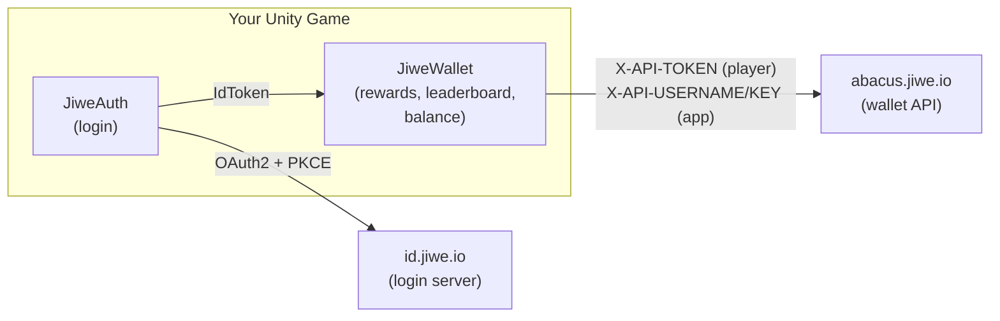
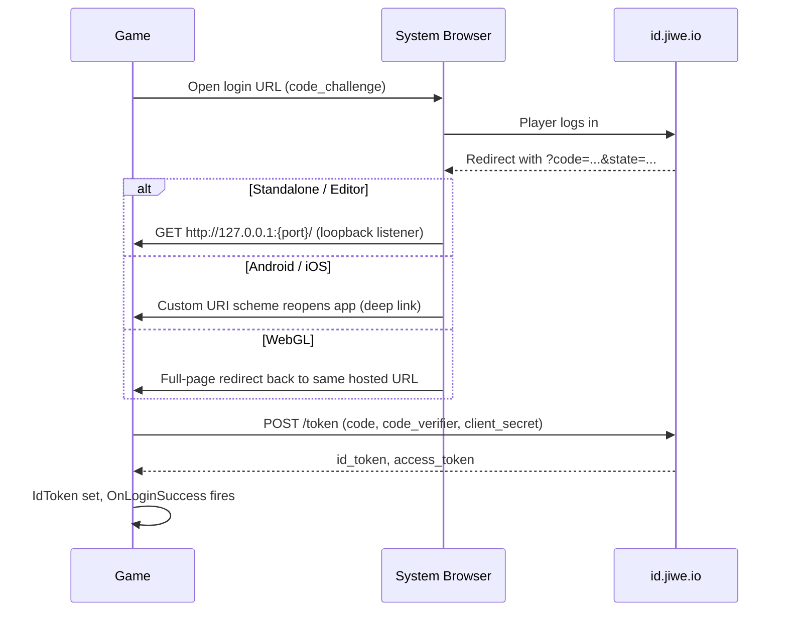
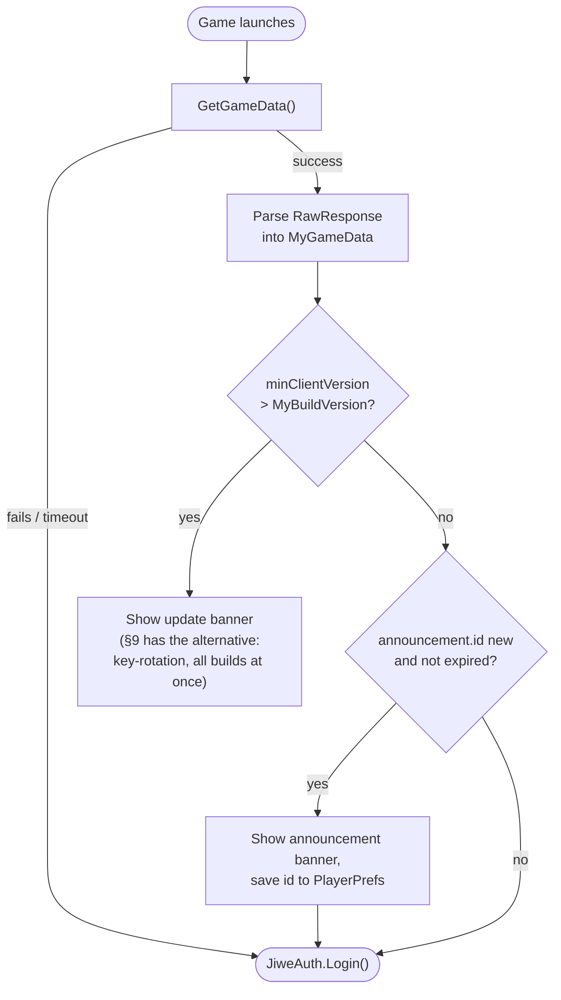

# Jiwe Wallet SDK for Unity

Log players into Jiwe with OAuth2 + PKCE, then credit them XP/points/airtime and read
leaderboard/wallet data — against Jiwe's real, live API (`id.jiwe.io` for auth,
`abacus.jiwe.io` for wallet calls).

Two scripts, no dependencies: `JiweAuth.cs` handles login, `JiweWallet.cs` handles
everything else. Copy `Jiwe/` into `Assets/` and you're done importing.

> **This doc is Unity-specific.** The concepts below — two credential pairs, the
> redirect-URI model, the reward/leaderboard API shape, the security rules, the
> Game Data patterns — are the same on any engine. If you're building the Unreal
> or Godot SDK next, §2, §3, §5, §8, §9, and §10 are the ones to port; §4
> (Quickstart), §6 (per-platform login mechanics), and §7 (WebGL export settings)
> are Unity/C#-specific.

---

## 1. Architecture at a glance



`JiweAuth` logs a *player* in and produces an `IdToken`. `JiweWallet` uses that token
for player-scoped calls, plus a separate static credential pair for app-scoped calls.
They're independent components wired together by one Inspector reference
(`JiweWallet.auth`).

---

## 2. Two credential pairs — don't confuse them

This is the single most common integration mistake: there are **two unrelated
credential pairs**, not one.

| Pair | Lives on | Identifies | Required for |
|---|---|---|---|
| `clientId` + `apiSecret` | `JiweAuth` | your **app**, used to run OAuth login | Logging a player in at all |
| `apiUsername` + `apiKey` | `JiweWallet` | your **app**, sent as `X-API-USERNAME`/`X-API-KEY` | Every wallet API call, even before login |

Get all four by logging in at [www.jiwe.io](http://www.jiwe.io) → **Profile** →
**My Apps** → **Create an Application** — one application per game. **Before you
open that form, read §3** — it asks for a Redirect URI you need to have decided
already, not something to improvise mid-form.


There is **no purchase (charge-the-player) endpoint** in the current API — an older
SDK's `Purchase()` call has no live equivalent and was removed rather than left
pointing at a dead host.

---

## 3. Redirect URIs — decide these *before* you create your app

The app-creation form (§2) has a **Redirect URIs** field that's blank by default,
with no platform default shown in the UI. **Jiwe doesn't generate or infer this
value — you define it yourself, once, in the form** — and it must then match,
exactly, whatever `redirect_uri` your build actually sends on login. Decide these
per platform *before* you fill in the form, using what `JiweAuth` actually sends:

| Platform | `redirect_uri` the SDK actually sends | Register this |
|---|---|---|
| Standalone / Editor | `http://127.0.0.1:<random port>/` — a **new free port every login**, as shipped | Not registerable as-is — see fix below |
| Android / iOS | `<mobileRedirectScheme>://oauth-callback` — default scheme is `jiwewallet` unless you changed the `mobileRedirectScheme` field on `JiweAuth` | `jiwewallet://oauth-callback` (or your own scheme, kept in sync with the Inspector field) |
| WebGL | Your hosted game's own page URL, no query string (e.g. `https://yourgame.com/play`) | That exact hosted URL — one entry **per environment** (local/staging/production), see note below |

> **Standalone/Editor as shipped can't be registered, because it's not one fixed
> value** — `JiweAuth` picks a new free loopback port every login
> (`GetFreeLoopbackPort()` in `JiweAuth.cs`), and since the redirect URI you
> register is a value *you* fix once in the form, a moving port can never match it.
> **Before your first Standalone/Editor login test**, pin that method to a single
> constant port (e.g. `http://127.0.0.1:53682/`) and register that exact string.
> Skipping this means Standalone/Editor login fails on every attempt with a
> redirect_uri mismatch — it isn't optional or Editor-only-a-quirk, it's required
> for that platform to work at all.

> **WebGL doesn't have Standalone's random-port problem — your hosted URL is
> already one fixed value — but you almost certainly deploy to more than one
> URL**, and each needs its own exact entry in the same Redirect URIs field
> (it accepts a comma-separated list — see the form's own placeholder text):
> - **Local testing**: whatever serves your local WebGL build must also be a
>   **fixed, predictable URL** (e.g. always `http://localhost:8000/`), or you're
>   back to the same moving-target problem Standalone has — pick one local dev
>   server/port and stick to it rather than letting it float.
> - **Staging and production**: register both, as separate exact entries, the
>   moment you know those domains — not just production.
> - **Hosting directly on Jiwe IO (not your own domain)?** The redirect URI is
>   still just "the game's own hosted page," but that now means the page Jiwe
>   itself gives your game, e.g. `https://jiwe.io/games/your-game-slug` — not a
>   `/callback` route you invent. Confirm the exact URL/slug with Jiwe (§11) if
>   it isn't decided yet, since you can't register it until you know it. It must
>   match byte-for-byte: no trailing slash, no query string.
> - **CORS is a separate ask from redirect_uri registration.** Registering a URL
>   here does not also whitelist it for the browser-side token-exchange request —
>   ask Jiwe (§11) to CORS-whitelist every domain you just registered, at the same
>   time, so you don't rediscover this domain-by-domain as each environment goes
>   live.
> - **Don't confuse this field with "Website."** The form also has a separate
>   **Website** field (your Jiwe profile page, e.g. `https://jiwe.io/profile/your-name`,
>   or your studio site) — that's unrelated to login and never needs to match
>   anything your build sends. Only **Redirect URIs** has to match `redirect_uri`
>   byte-for-byte.

The same form also has an **"My app will..."** scope checklist — check every scope
the SDK actually requests (`openid`, `profile`, `in-app-purchases`, `rewards`; see
the `Scope` constant in `JiweAuth.cs`). Leaving one unchecked produces the same
undiagnosable `access_denied` redirect as a missing `scope` param — decide this
alongside your redirect URIs, not after a failed login. **The checkboxes don't
show the raw scope names** — `openid`/`profile` are labeled plainly ("Identify
and log in users" / "Read the user's name and avatar," both marked `required`),
but `in-app-purchases` and `rewards` both appear as separate `legacy`-tagged
checkboxes reading **"Include the user's wallet ID in the token"** — check both
of those too, not just the two `required` ones, or reward calls will fail even
though login succeeds.

---

## 4. Quickstart

1. **Decide your redirect URIs and scopes** — see §3. Do this first; you need the
   values in hand for step 2.
2. **Get credentials.** Log in at [www.jiwe.io](http://www.jiwe.io) → **Profile** →
   **My Apps** → **Create an Application**, entering the redirect URIs/scopes from
   step 1, to generate `clientId` / `apiSecret` / `apiUsername` / `apiKey` for this
   game.
3. **Import.** Copy `Jiwe/` (`JiweAuth.cs` + `JiweWallet.cs`) into `Assets/`. No
   Newtonsoft dependency — it uses Unity's built-in `JsonUtility`.
4. **Wire it up.** Create an empty GameObject ("JiweSDK"), add both `JiweAuth` and
   `JiweWallet` to it, and drag the `JiweAuth` component into `JiweWallet.auth`.
5. **Fill in credentials** on the two components (see the table in §2). Do this via a
   gitignored config asset, not hardcoded — see §8.
6. **Run.** With `loginOnStart` checked (default), the login page opens automatically;
   `JiweAuth.OnLoginSuccess` fires once `IdToken` is populated.
7. **Building for WebGL?** Set your export/compression settings per §7 before your
   first upload — a wrong Compression Format is the single most common reason a
   build "uploads fine" but shows a blank page.

```csharp
jiweAuth.OnLoginSuccess += () => {
    jiweWallet.GiveXpReward(20, "Reward for passing boss#1", result => {
        if (result.Success) Debug.Log("XP awarded!");
        else Debug.LogWarning($"XP reward failed: {result.Error}");
    });
};
```

---

## 5. API reference

All calls are async/callback-based; every result carries `Success` + `Error` (+
call-specific fields).

| Method | Needs login? | Notes |
|---|---|---|
| `GiveXpReward(xp, description, onComplete, transactionId?)` | Yes | XP has no monetary value |
| `GivePointsReward(points, description, onComplete, transactionId?)` | Yes | "Cowrie" — Jiwe's in-game currency |
| `GiveAirtimeReward(units, phoneNumber, description, onComplete, transactionId?)` | Yes | Min. 5 units; credits real airtime |
| `GetLeaderboard(rewardType, maxEntries, period, bestPointsRanking, onComplete)` | No | `rewardType`: `"xp"`\|`"cowrie"`; `period`: `"day"`\|`"week"`\|`"month"`\|`"year"`\|`null` |
| `GetWalletBalance(onComplete)` | No | Your app's own balance, not a player's |
| `GetTransactionStatus(transactionId, onComplete)` | No | Poll any `ledger_transaction_id` from a reward result |
| `CheckCredentialsValid(onResult)` | No | See §9, forced-update pattern |

`transactionId` is auto-generated if omitted. All three reward calls return the same
`JiweWalletResult { Success, Error, RawResponse }` shape.

```csharp
jiweWallet.GetLeaderboard("xp", maxEntries: 20, period: null, bestPointsRanking: "highest", result => {
    if (result.Success)
        foreach (var e in result.Entries) Debug.Log($"{e.rank}. {e.name} — {e.currentXP}");
});
```

---

## 6. Login flow, per platform

`JiweAuth` runs standard OAuth2 Authorization Code + PKCE, but how the browser hands
control back to your game is inherently different per platform — this is the one part
of the SDK that can't be unified. (For what `redirect_uri` to register for each of
these, see §3 — decide that *before* your first login test.)



| Platform | Mechanism | Extra setup |
|---|---|---|
| Standalone / Editor | Local loopback HTTP listener catches the redirect | Pin the port and register it — see §3 |
| Android / iOS | System browser → custom URI scheme (`mobileRedirectScheme`) reopens the app | Register that redirect URI with Jiwe — see §3 |
| WebGL | Jiwe redirects back to your **same hosted page** with `?code=...`; page reloads and resumes | Jiwe must allow CORS from your hosted domain; also see §7 for export settings |

`networkTimeoutSeconds` (default 20s) bounds every step of this flow — a hung browser
or dead network fails visibly instead of hanging forever. **Always** also wire a
Skip/Cancel button, clickable the *entire* time login is in progress:

```csharp
skipButton.onClick.AddListener(() => {
    jiweAuth.Cancel(); // safe to call unconditionally, even if nothing's in progress
    ShowMainMenuAnonymously();
});
```

---

## 7. WebGL export settings for Jiwe hosting

Before uploading a WebGL build to Jiwe hosting, set these in **Edit → Project
Settings → Player → WebGL → Publishing Settings**:

| Setting | Required value | Why |
|---|---|---|
| Compression Format | `Disabled` | Both compressed options have real, hosting-breaking failure modes — see below |
| Decompression Fallback | `Off` | Not needed once compression is disabled |

Yes, this makes the build bigger (uncompressed `.data`/`.wasm`/`.framework.js`
instead of the ~30%-smaller compressed versions). That's a deliberate tradeoff, not
an oversight — see why below.

### Why not compression?

Unity offers two ways to compress WebGL output, and both have real,
hosting-breaking failure modes confirmed firsthand:

1. **Server-side `Content-Encoding`** (`Compression Format = Gzip`/`Brotli`,
   `Decompression Fallback = Off`) — Unity's compressed output uses a `.unityweb`
   extension, but the bytes on the wire aren't raw gzip/brotli; they're wrapped in
   Unity's own proprietary format (the literal string `"UnityWeb Compressed
   Content (brotli)"` at the start of the file). If a host sets
   `Content-Encoding: gzip`/`br` for these files — an easy default for any generic
   static host to apply automatically based on the "compressed-looking" filename —
   the browser tries to transport-decode a stream that isn't valid gzip/brotli and
   fails outright (`net::ERR_CONTENT_DECODING_FAILED`), which cascades into
   `unityFramework is not defined`. Nothing errors on upload; the player just gets
   a blank page.
2. **Decompression Fallback** (`Compression Format = Gzip`/`Brotli`,
   `Decompression Fallback = On`) — meant to be the safe option: Unity bundles its
   own JS decompressor into `loader.js`, no server config needed. Confirmed
   unreliable in Unity `6000.0.41f1` — the JS-side decompressor throws
   (`Cannot read properties of undefined (reading 'match')`) partway through the
   framework/wasm response, silently preventing `.data` from ever loading.
   Reproduced identically on a real hosted deploy and a clean local test — a
   genuine engine-version bug, not a hosting misconfiguration. Worth re-testing on
   later Unity versions before trusting this setting again.

`Compression Disabled` sidesteps both: no wrapper format, no JS decompressor,
nothing for a host or browser to get wrong. Bigger download, but it actually loads.

### If a build "uploads fine but shows a blank page or endless loading bar"

This is the standard symptom for both failure modes above, and it won't surface on
the upload/hosting side — only in the player's browser console once someone
actually opens the game.

1. Open the hosted URL in a real desktop browser, open DevTools → Console.
2. `net::ERR_CONTENT_DECODING_FAILED` or `unityFramework is not defined` → the host
   is setting `Content-Encoding` on `.unityweb` files it shouldn't. Fix: rebuild
   with `Compression Disabled` — don't try to fix it at the hosting layer.
3. Check the Network tab: does `<name>.data`/`.data.unityweb` ever get requested?
   If framework and wasm load but `.data` never does, and there's an uncaught
   promise rejection in `loader.js` — that's the Decompression Fallback bug. Fix:
   rebuild with `Compression Disabled`.
4. If neither applies and the build has **Thread Support** on (check Player
   Settings, or look for `SharedArrayBuffer` in `loader.js`), confirm the hosting
   route sends both `Cross-Origin-Opener-Policy: same-origin` and
   `Cross-Origin-Embedder-Policy: require-corp` — missing either silently breaks
   thread startup the same way.

---

## 8. Security checklist

Real bugs found (and fixed, in this SDK) shipping a live game against Jiwe's actual
servers — not theoretical advice.

- [ ] **Skip/Cancel button stays clickable for the whole login flow**, not just
      before it starts. This was the single costliest mistake building against this
      SDK.
- [ ] **`apiSecret` is sent in the token exchange's POST body on every platform**,
      including a pure-PKCE mobile flow. Confirmed by a live 401 `invalid_client`
      when omitted — Jiwe's server isn't spec-pure "public client" here. Don't
      "fix" this away without re-testing against a real login.
- [ ] **No real credentials hardcoded in a committed script/scene/prefab.** Load
      them at runtime from a gitignored `ScriptableObject`:

  ```csharp
  var config = Resources.Load<MyJiweCredentialsConfig>("MyJiweCredentials");
  if (config != null) {
      jiweAuth.clientId = config.clientId;
      jiweAuth.apiSecret = config.apiSecret;
      jiweWallet.apiUsername = config.apiUsername;
      jiweWallet.apiKey = config.apiKey;
  }
  ```
  One `.gitignore` line (`Assets/Resources/MyJiweCredentials.asset`) keeps real keys
  out of git while every rebuild still picks them up.

---

## 9. Forcing an update via key rotation

If you need to push all players to a new build (breaking API change, key
compromise), rotate `apiUsername`/`apiKey` on Jiwe's side and gate a banner on
`CheckCredentialsValid`:

```csharp
jiweWallet.CheckCredentialsValid(valid => {
    if (!valid) ShowUpdateRequiredBanner();
});
```

This reports `false` **only** on a definitive 401/403 (credentials actively
rejected) — a network blip, timeout, or 5xx reports `true`, so a transient outage is
never mistaken for "this build is stale."

Key rotation is deliberately blunt: the moment you rotate, **every build ever
shipped** breaks at once — there's no way to let recent-but-not-latest builds keep
working. That bluntness is exactly the point for revoking a leaked key. If you
want graduated control instead (e.g. "builds below version 7 must update, 7 and
above are fine"), see §10 for a version-gate built on Game Data instead — the two
approaches are complementary, not competing; use whichever matches the situation.

---

## 10. Game Data patterns

`JiweWallet.GetGameData`/`SetGameData` give you raw read/write access to an
app-scoped JSON blob — no player login needed, no schema enforced by the SDK.
What you store and how you interpret it is entirely up to you; the two patterns
below are starting points, not something the SDK bakes in.

```csharp
[Serializable] class MyGameData { public int minClientVersion; public Announcement announcement; }
[Serializable] class Announcement { public string id; public string message; public string expiresAt; }
```

Both patterns below read the same blob at launch, before login starts:



Every failure path in this diagram — a network blip, a missing key, a malformed
response — should land on the same branch as "fails/timeout": proceed to login
as normal. Only a *definitive* value that says "you're behind" should ever block
anything, same reasoning as `CheckCredentialsValid` in §9.

### Minimum-version gate

A graduated alternative to key rotation (§9): bump `minClientVersion` in Game Data
whenever you want to force an update, and compare it against a version constant
baked into each build. Unlike key rotation, this doesn't touch your working API
credentials, and it lets you draw the line at an exact version instead of "every
build before right now."

```csharp
const int MyBuildVersion = 7;

jiweWallet.GetGameData(result => {
    if (!result.Success) return; // fail OPEN — a network blip should never look like "must update"
    var data = JsonUtility.FromJson<MyGameData>(result.RawResponse);
    if (data.minClientVersion > MyBuildVersion) ShowUpdateBanner();
});
```

Run this before `JiweAuth.Login()` fires, not after — it's app-scoped, so there's
no reason to send a player through a full login round-trip only to reject them
afterward. Fail open on any error (missing data, timeout, malformed response) —
the same reasoning as `CheckCredentialsValid` (§9): a transient failure should
never be mistaken for "this build is stale."

### Announcement banner

Same Game Data blob, a different field — an in-game message an admin can change
without a build, e.g. "double XP weekend live now."

```csharp
jiweWallet.GetGameData(result => {
    if (!result.Success) return;
    var data = JsonUtility.FromJson<MyGameData>(result.RawResponse);
    var a = data.announcement;
    if (a == null || a.id == PlayerPrefs.GetString("lastSeenAnnouncement", "")) return;
    if (!string.IsNullOrEmpty(a.expiresAt) && DateTime.UtcNow > DateTime.Parse(a.expiresAt)) return;

    ShowAnnouncement(a.message);
    PlayerPrefs.SetString("lastSeenAnnouncement", a.id);
});
```

- **"Have I shown this already?" is tracked locally** (`PlayerPrefs`), not on
  Jiwe — it's a per-device concern, not something that needs the player's own
  User Data or even a completed login.
- **`expiresAt` is optional but recommended** — if an admin forgets to clear an
  old announcement after an event ends, it silently stops showing instead of
  nagging players indefinitely. Plain client-side date comparison, no server
  logic involved.
- **Non-blocking by design** — a dismissible banner, not something that stops
  the player from doing anything else, consistent with §8's degrade-gracefully
  approach to failures generally.
- This is **not a push notification** — it only reaches a player who has the
  game open and happens to read Game Data at that moment. There's no way to
  reach someone who isn't currently running the game.

### Writing Game Data

There's currently no non-technical way to edit Game Data from Jiwe's dashboard —
setting `minClientVersion` or `announcement` means calling `POST
/rest/api/v1/metadata/update/game-data` directly (e.g. from Postman), with
`X-API-USERNAME`/`X-API-KEY` headers, the same pair `JiweWallet` uses. Updates
merge/patch rather than replace — sending `{"announcement": {...}}` doesn't
clear `minClientVersion` or vice versa, but if you need to remove a field
entirely rather than change it, set it to `null` explicitly.

---

## 11. Troubleshooting

| Symptom | Cause | Fix |
|---|---|---|
| `invalid_client` 401 on token exchange | `apiSecret` missing from POST body | It's required on every platform — see §8 |
| Login hangs forever with no error | No timeout / no Cancel wired | Set `networkTimeoutSeconds`, wire Skip/Cancel (§6) |
| WebGL token exchange fails with a CORS error | Jiwe hasn't allow-listed your hosted domain | Ask Jiwe to whitelist your domain |
| Reward call silently does nothing | Player not logged in | Reward calls need `auth.IsLoggedIn == true` first |
| Leaderboard entry shows XP `0` | Some entries carry the total under `currentXP` instead of `xp` | Prefer `currentXP` when nonzero |
| Response written after `HttpListener.Stop()` throws silently | `Stop()` called before the browser response finished writing | Already fixed in `LoginViaLoopback` — don't reorder if you touch it |
| Login redirect fails / `redirect_uri` mismatch, only in Standalone/Editor | Random loopback port never matches your one fixed registered `redirect_uri` | Pin `GetFreeLoopbackPort()` to a constant port and register that exact URI — see §3 |
| WebGL build "uploads fine" but shows a blank page / endless loading bar | Compression Format not Disabled, or (threaded builds only) missing COOP/COEP headers | See §7 |

Still stuck (e.g. need your domain CORS-whitelisted, or an app-key issue)? Contact
Jiwe directly: WhatsApp **+254773754444** or **rock@jiwe.io**.

---

## 12. Jiwe IO platform basics

Steps outside the SDK itself — registering an account and creating your application.

<details>
<summary>Registering on Jiwe IO and creating an application</summary>

1. Go to [www.jiwe.io](http://www.jiwe.io), sign up, and log in.
2. Open **Profile** → **My Apps**.
3. Decide your redirect URIs and scopes first — see §3.
4. **Create an Application** — this generates the `clientId` / `apiSecret` /
   `apiUsername` / `apiKey` set your game needs (see §2). Create one application
   per game.

</details>

<details>
<summary>Uploading your game to Jiwe IO</summary>

Upload directly from the Jiwe IO upload page — no form or manual handoff needed. If
you're on WebGL, see §7 before your first upload.

</details>

---

## Roadmap

- **Unreal and Godot SDKs.** When they land, §2, §3, §5, §8, §9, and §10 above
  (credential model, redirect-URI model, API surface, security checklist, Game
  Data patterns) should carry over almost unchanged — only §4 (Quickstart), §6
  (platform redirect mechanics), and §7 (WebGL export settings, if the target
  engine ships a WebGL exporter with similar tradeoffs) are engine-specific and
  will need their own writeup per engine.
- **A non-technical way to edit Game Data.** Right now setting `minClientVersion`
  or `announcement` (§10) means a dev hand-crafting a Postman request — fine for
  occasional use, but worth a real dashboard control if this becomes routine.
- **Celo wallet / Kotani Pay withdrawal flow.** Partially built — connecting a
  Jiwe wallet to Celo and withdrawing out to M-Pesa via Kotani Pay exists but
  isn't finished end-to-end. Not documented here yet; will get its own section
  once the flow is stable.
